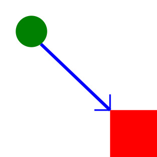

# AboutMe
## Who am I?
**Yin Guan**, *a senior in University of Missouri*

## Self Introduction

### Hobbies
**Basketball**
My favourite player is Kobe Bryant.

The picture can be found in <https://www.biography.com/athlete/kobe-bryant>.

**Programming**
I have learned several programming languages in class,

- Python
- HTML/JavaScript
1. Using Python, I tried the turtle library to perform image processing, as shown in [TurtleImage](https://github.com/guanyinwudi/AboutMe/src)
2. Using SVG, I wrote a picture generated by texteditor. What an amazing experience!

